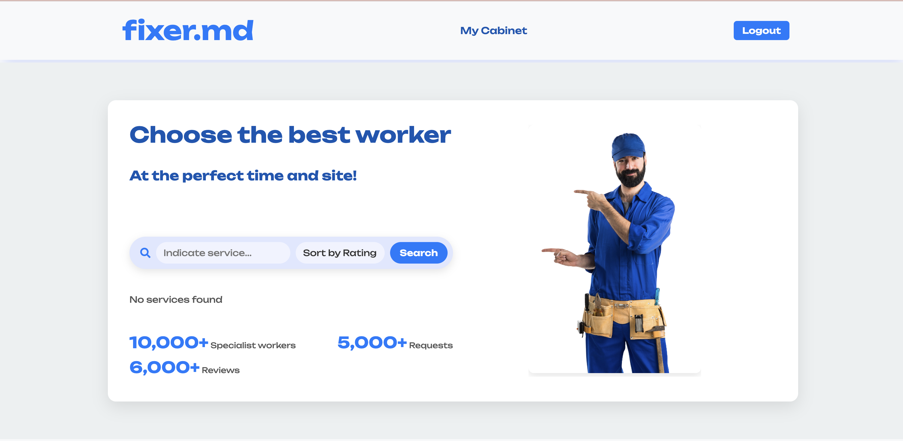
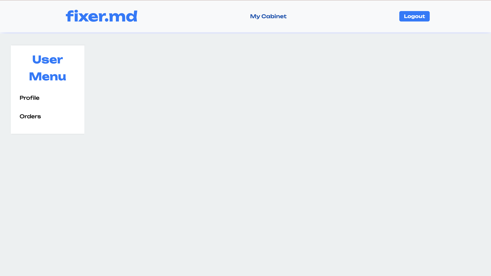
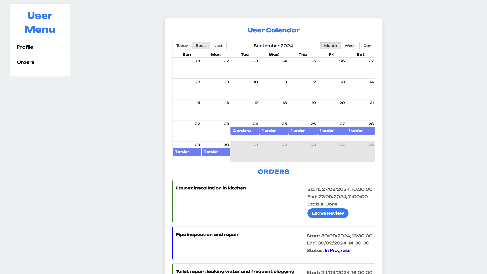

# Changelog

---

## November 7, 2024

### What's New?

We have improved the design and made it easier for the user to navigate our platform.

### Why the Change?

This change is part of our ongoing efforts to improve the design and user friendliness of our platform.

- We have enhanced the **user friendliness** by improving design, adding a cabinet for the user to access their profile and history of orders, since before it was more tricky to access these pages.

---

## Specific Changes

### Added Cabinet for User

- We have added a cabinet for the user that they can access through the header of our site. When Accessing it they will be redirected to a menu.

### Added Menu for User

- The menu has 2 pages featured: user profile and orders. The User Profile page features information about the user, the Orders page features the user's history of orders.

### Added Orders Page for User

- We added the Orders page to showcase the history of the user's orders. There they can view existing orders both in a calendar and in a list. Moreover, they can see the details of each order: Start, End date, status. Moreover, they can leave review if the order's status is "Done".

## Fixes
### Fix Log In Sig Up button reappearing after each refresh

- The Log In and Sign Up buttons were reappearing instead of showing LogOut button after each refresh, even if the user was logged in. This was due to authentification state not being used properly. Fixed this and now the LogOut button stays after refresh.

