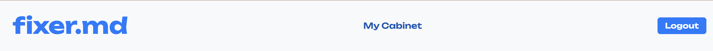

# Changelog

---

## November 7, 2024

### What's New?

We have improved the design and made it easier for the user to navigate our platform.

### Why the Change?

This change is part of our ongoing efforts to improve the design and user friendliness of our platform.

- We have enhanced the **user friendliness** by improving design, adding a cabinet for the user to access their profile and history of orders, since before it was more tricky to access these pages.

---

## Specific Changes

### Added Cabinet for User

- We have added a cabinet for the user that they can access through the header of our site. When Accessing it they will be redirected to a menu.

### Added Menu for User

- The menu has 2 pages featured: user profile and orders. The User Profile page features information about the user, the Orders page features the user's history of orders.

### Added Orders Page for User

- We added the Orders page to showcase the history of the user's orders. There they can view existing orders both in a calendar and in a list. Moreover, they can see the details of each order: Start, End date, status. Moreover, they can leave review if the order's status is "Done".

### Redesigned Choose Role, Log In, and Sign Up

We have completely revamped the design for the Choose Role, Log In, and Sign Up pages to provide a more streamlined and user-friendly experience.

- **Choose Role**: The previous design was functional but felt cluttered. We have simplified the layout, making it easier for users to select their role with clear and distinct options.
- **Log In**: The Log In page now features a more modern and minimalistic look, reducing distractions and helping users focus on entering their credentials.
- **Sign Up**: The Sign Up form has been redesigned for better usability, featuring a cleaner layout and improved input fields for a smoother registration process.

| **Choose Role (Before)** | **Choose Role (After)** |
|--------------------------|-------------------------|
|  |  |

| **Sign Up (Before)**     | **Sign Up (After)**     |
|--------------------------|-------------------------|
|  |  |

| **Log In (Before)**      | **Log In (After)**      |
|--------------------------|-------------------------|
|  |  |

### Enhanced Search Bar Design

- We have redesigned the Search Order bar on the main page to offer a cleaner, more intuitive experience.

| **Search Bar (Before)**      | **Search Bar (After)**      |
|--------------------------|-------------------------|
|  |  |

## Fixes
### Fix Log In Sign Up button reappearing after each refresh

- The Log In and Sign Up buttons were reappearing instead of showing LogOut button after each refresh, even if the user was logged in. This was due to authentification state not being used properly. Fixed this and now the LogOut button stays after refresh.

---
## November 22, 2024

### What's New?

We have added the favorite workers and all workers functionality for users.

### Why the Change?

This change is part of our ongoing efforts to improve the user friendliness of our platform.

- We have enhanced the **user friendliness** by adding in the cabinet a favorites page and by adding a workers page in the menu where the user can view all workers.

---

### Specific Changes

#### Added Favorites Page in Cabinet

- We have added a new page in the client’s cabinet: Favorite Workers. I displayed there the list of the client’s favorite workers. In each card in the list there can be seen the worker’s name, a View Profile Button and a Remove button. If they click the View Profile button they will be redirected to the worker’s profile with their personal data and offered services. If they click the Remove button the worker will be removed from the list.

- Link to Pull Request for this task: 
    - https://github.com/victoriaaa111/frontend/pull/23

#### Improved message display for Favorites page

- We have added a message in green signaling the success of the delete operation. In case of any errors a message in red will appear.

| **Success Message when removing worker**      | **Error Message**      |
|--------------------------|-------------------------|
|  |  |

- Link to Pull Request: 
    - https://github.com/victoriaaa111/frontend/pull/26

#### Added Loading State message for Worker Profile

- We added a Loading message for when the data for the worker profile is loading.

- Link to Pull Request: 
    - https://github.com/victoriaaa111/frontend/pull/26

### Removed Cabinet from Menu when not logged in

- We removed the Cabinet button from the menu when the user is not logged in and made it so when they click the Cabinet button they are redirected directly to the profile.

| **Menu when Logged In**      | **Menu when Logged Out**      |
|--------------------------|-------------------------|
|  |  |

- Link to Pull Request: 
    - https://github.com/victoriaaa111/frontend/pull/25

### Enhanced Favorites Page Functionality

- Replaced the **Remove** button in favorite worker cards with a heart icon in the top-right corner. Users can now click the heart to add or remove workers from their favorites.

- Link to Pull Request: 
    - https://github.com/victoriaaa111/frontend/pull/28

### All Workers are displayed in a separate page

We have added a dedicated All Workers page where users can view a comprehensive list of all available workers on the platform.
 - Each worker is displayed as a card featuring their name, rating, and services provided. Users can click the "View Profile" button to navigate to the worker's detailed profile page.
 - The page includes a search bar with sorting options, allowing users to filter workers by service type and sort them by rating (low to high or high to low).
 - Users can mark workers as favorites by clicking the heart icon in the top-right corner of each card, adding them to their favorites list.
 - The page is optimized for all devices, ensuring a seamless experience on desktop and mobile.

This page improves the discoverability of workers and provides a structured way for users to explore and connect with specialists.

**All Workers Displayed**

- Link to Pull Request: 
    - https://github.com/victoriaaa111/frontend/pull/27

### Implemented the Debounce Function for Searching

- The debounce function was implemented in the search bar to reduce unnecessary API calls while typing, improving performance and user experience. It delays the execution of the search query until the user stops typing, ensuring fewer, more relevant requests are sent to the server. This prevents server overload and optimizes resource usage, creating a smoother and faster interaction for the user.

| **Searching Process Video** |
|----------------------------------------------

[ The Link for the video](https://drive.google.com/file/d/1MlIOHI7XhuqJXr9yPJuEihn3q_-12e2_/view?usp=drive_link)

| **The Search Bar**      | **Searching**      |
|--------------------------|-------------------------|
 |  |  |

- Link to Pull Request: 
    - https://github.com/victoriaaa111/frontend/pull/29

